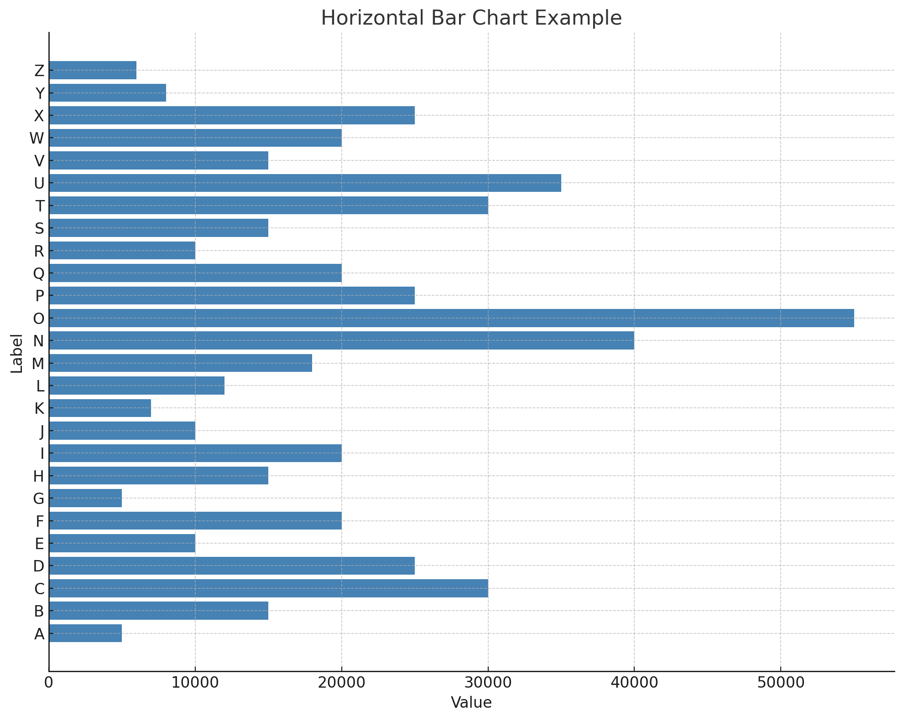
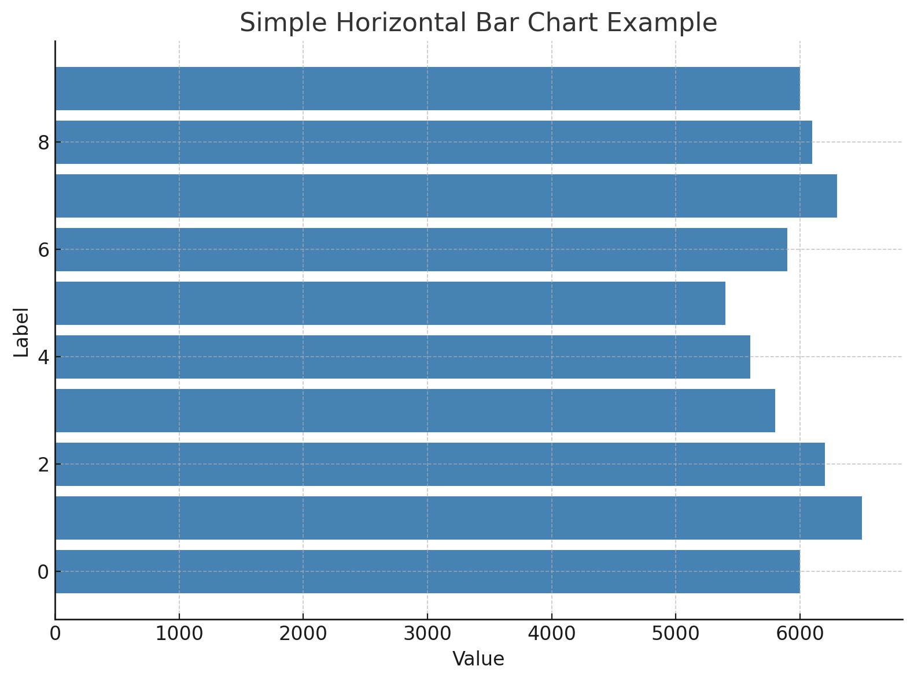
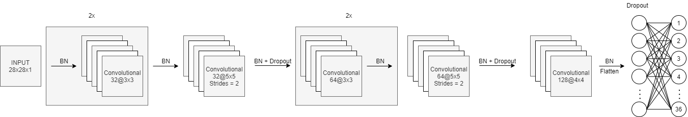

# Handwritten Digit Recognition using Machine Learning and Deep Learning

In this project, we'll use a deep neural network to recognize handwritten digits. We'll use the images of handwritten digits from the MNIST dataset.
Inspired by the structure and function of neurons in the human brain, deep learning leverages neural networks composed of interconnected layers. Training these networks requires vast amounts of data and sophisticated algorithms.

In this project, we'll harness PyTorch to develop a deep learning algorithm for handwritten digit recognition. Our dataset of choice will be MNIST, comprising 70,000 handwritten digits split into a training set of 60,000 images and a test set of 10,000 images. Through this endeavor, we aim to demonstrate the effectiveness of deep learning in the domain of image classificatio

Basic CNN model trained using MNIST and NIST dataset to predict handwritten characters (letters and digits), each image is resized to grayscale 28x28px image. The model included in this repo is not perfect as I'm still learning to improve it. More explanation below:

**NIST characters dataset**

**MNIST digits dataset**

**CNN Architecture**

**Demo**

**Features of the Handwriting Recognition System**

1. Supported Characters:

    * Recognizes 62 distinct characters:
      * Numbers: 0-9
      * Lowercase letters: a-z
      * Uppercase letters: A-Z

2. Flexible Character Placement:
   * Characters can be written anywhere on the canvas.
   * Requires only minimal horizontal spacing between characters for accurate recognition.

3. Sentence Recognition:
   * Capable of recognizing and processing whole sentences written on the canvas.

4. Messy or Broken Letter Detection:
   * Handles "broken" or "messy" handwriting with high accuracy, making it robust for real-world handwriting variations.

5. Modern Frontend Framework:
   * The system uses React.js as the frontend, providing a responsive and user-friendly interface.

# How Incoming Handwriting Data is Processed and Fed Into the Models

### 1. User Input
- A user writes "Hey you" on the canvas in the frontend application.
- The frontend captures the canvas content and converts it into a **binary blob**.

### 2. Sending Data to the Backend
- The binary blob is sent as a **POST request** to the Django backend.
- Django saves the image and loads it into **OpenCV (cv2)** for further processing.

### 3. Preprocessing the Image
- The entire image ("Hey you") is trimmed to remove excess pixels around the handwriting.
- The trimmed image is **split into individual characters**: "H", "e", "y", "y", "o", "u".
- Characters are segmented based on discontinuities in the x-direction:
  - Small gaps are ignored.
  - Large gaps (like those between words) are stored in a variable `space_location`.
- Each character image is further trimmed of excess pixels.

### 4. Preparing Images for the Model
- Each character image is padded to make it square, ensuring no distortion occurs when resizing.
- Images are normalized:
  - Pixel values are scaled from **0-255** to **0-1**.
  - Images are converted to **NumPy arrays** for model compatibility.

### 5. Character Prediction
- Each character is passed through all trained models in a loop.
- Each model outputs a **predicted index** (e.g., 17 for "H") corresponding to one of the 47 trained characters.
- The **most popular prediction** across all models is added to the final result (`final_prediction`).

### 6. Handling Ambiguities in Casing
- If the predicted character is alphabetical, the algorithm checks if the lowercase equivalent exists in the character mapping.
- For characters like "y", where the case depends on size, the decision is based on the **height of the image** stored in `char_img_heights`.
- This ensures correct differentiation between uppercase and lowercase letters.

### 7. Handling Spaces
- If the loop iteration corresponds to a value in `space_location`, a space (`" "`) is added to `final_prediction` at that point.
- For example, a space is added after the first "y", resulting in "Hey ".

### 8. Final Result
- Django combines all processed predictions into a final result, "Hey you".
- The result is sent back to the frontend, where **React displays the output** to the user.

This pipeline ensures accurate recognition of handwriting, handling complexities such as word spacing, letter casing, and broken or messy letters.

**Prerequisites**
* Python 3.5 and up
* Tkinter
* Tensorflow
* Keras
* Scikit-learn
* Pillow 7.1.2